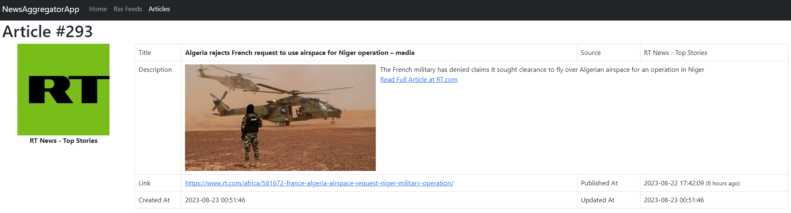
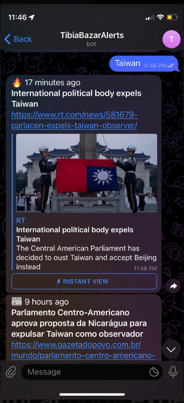
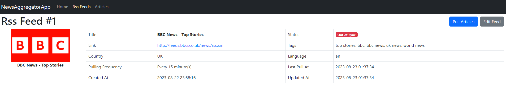
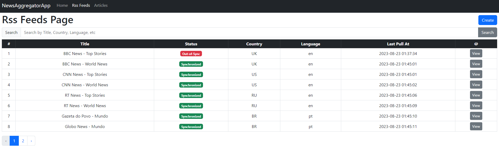
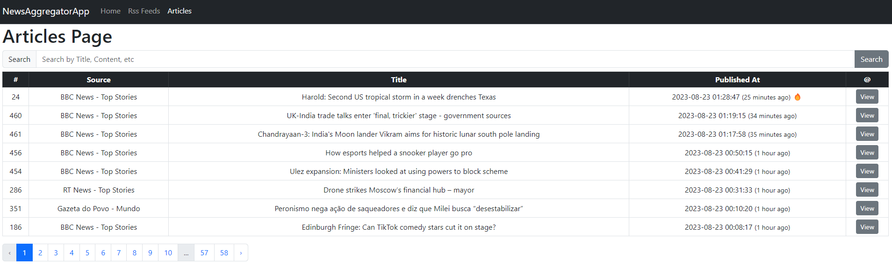

# NewsAggregatorApp

Welcome to NewsAggregatorApp project! This guide will walk you through the steps to get the project up and running on your local environment.





## Requirements

Before you begin, make sure you have the following software installed:

- [PHP](https://www.php.net/manual/en/install.php) (>= 7.4)
- [Composer](https://getcomposer.org/download/)
- [MySQL](https://dev.mysql.com/downloads/installer/) or another compatible database

## Installation

1. Clone the repository:

   ```sh
   git clone https://github.com/shakkurcwb/NewsAggregatorApp
   ```

2. Navigate to project repository:

    ```sh
    cd NewsAggregatorApp
    ```

3. Install PHP dependencies:

    ```sh
    composer install
    ```

4. Create a copy of the `.env.example` file and rename it to `.env`.

5. Update the database and other configuration settings in this file.

- For SQLite, simple use `DB_CONNECTION=sqlite` and create a blank file on `database/database.sqlite`.

- For more database engines, please check the [Laravel Docs](https://laravel.com/docs/8.x/database#configuration).

6. Run database migrations to set up the database schema:

    ```sh
    php artisan migrate
    ```

7. (Optional) Seed the database with sample data:

    ```sh
    php artisan db:seed
    ```

8. Start the development server:

    ```sh
    php artisan serve
    ```

9. (Optional) Pull the latest news using the console command:

    ```sh
    php artisan rss:collect
    ```

10. (Optional) Reply to Telegram messages using the console command:

    ```sh
    php artisan telegram:handler
    ```

11. (Optional) Or run the development task scheduler worker (includes both commands - see more on `app\Console\Kernel.php`):

    ```sh
    php artisan schedule:work
    ```

Now you should be able to access the project by visiting http://localhost:8000 in your web browser.

## Additional Information

Make sure to consult the official Laravel documentation for more in-depth information on various aspects of the framework.

If you encounter any issues during the installation process, feel free to reach out to contact me or create an issue.

Happy coding!

## License

This project is licensed under the MIT License.

## More Pictures






